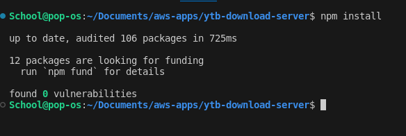
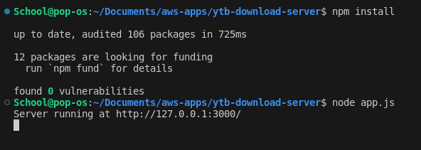
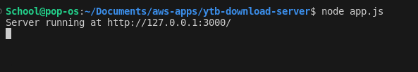

# Basic YouTube Downloader Extension - Server Side Code
Server-side code for YouTube Downloader chrome extension

## Usage
1. Clone this repository: 
```
git clone https://github.com/SagaOfAGuy/ytb-download-server.git
```

2. Install the node package dependencies: 
```
cd ytb-download-server && npm install
```


3. Start the Node server:
```
node app.js
```


4. App.js should now be running on port 3000: 



## Deploying with AWS App Runner
Coming soon... 